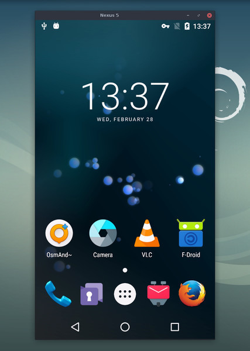

## ScrcpyPicker

ScrcpyPicker is a lightweight macOS Menu Bar app (MenuBarExtra). It lives in the menu bar as an icon, lists connected Android devices over `adb`, and starts mirroring with `scrcpy` using your preferred options.

Latest version: 1.0.1

Download: https://github.com/iamkurtgoz/ScrcpyPicker/releases/download/1.0.1/ScrcpyPickerV1.0.1.zip



This project builds on top of the excellent open source tool [scrcpy](https://github.com/Genymobile/scrcpy) by Genymobile.

---

### Requirements
- **ADB** (Android Platform Tools)
  - Install (Homebrew):
```bash
brew install --cask android-platform-tools
```
- **scrcpy**
  - Install (Homebrew):
```bash
brew install scrcpy
```

Note: The app first tries `/opt/homebrew/bin/scrcpy`; if missing, it falls back to the `scrcpy` found in `PATH`.

### Quick Start
1. Download `ScrcpyPicker.app`: https://github.com/iamkurtgoz/ScrcpyPicker/releases/download/1.0.1/ScrcpyPickerV1.0.1.zip
2. Unzip and double‑click `ScrcpyPicker.app`.
3. A new icon appears in the macOS menu bar.
4. Click the icon → pick your Android device from the list → press Start (or select directly).
5. Open Settings from the menu to adjust options like codec, fps, bitrate, audio, etc.

### Features
- Max size, Max FPS
- Turn screen off while mirroring
- Audio forwarding
- Video codec selection: H.264 / H.265 / AV1
- Bitrate control
- UHID keyboard for better key mapping
- Custom window title, Always on top
- Recording (choose output path)
- Show touches, Keep device awake
- Power off device on close, Kill server on close
 - Menu bar presence for one‑click access (MenuBarExtra)

### How It Works
1. The menu bar popover queries `adb devices -l` and lists only devices in `device` state.
2. From the popover, choose a device and (optionally) tweak Settings.
3. ScrcpyPicker launches `scrcpy` with the selected options and connects to the chosen device.

### Known Limitations
- Only lists devices in `device` state.
- The app requires `adb` and `scrcpy` to be installed.

### Localization
- Looking for Turkish? See `README.tr.md`.

## Find this repository useful? :heart:
Support it by joining __[stargazers](https://github.com/iamkurtgoz/ScrcpyPicker)__ for this repository. :star: <br>
Also, __[follow me](https://github.com/iamkurtgoz)__ on GitHub for my next creations! 🤩

# License
```xml
    Copyright 2024 Mehmet KURTGOZ

    Licensed under the Apache License, Version 2.0 (the "License");
    you may not use this file except in compliance with the License.
    You may obtain a copy of the License at

    http://www.apache.org/licenses/LICENSE-2.0

    Unless required by applicable law or agreed to in writing, software
    distributed under the License is distributed on an "AS IS" BASIS,
    WITHOUT WARRANTIES OR CONDITIONS OF ANY KIND, either express or implied.
    See the License for the specific language governing permissions and
    limitations under the License.
```