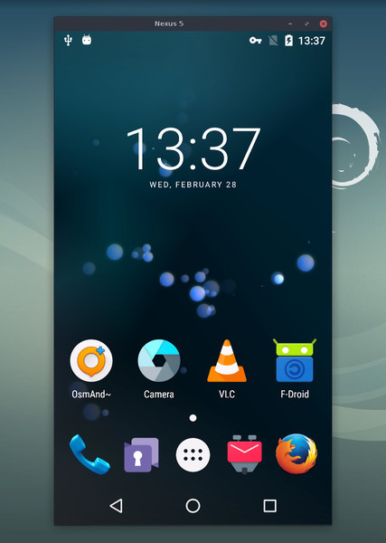

## ScrcpyPicker

ScrcpyPicker bir macOS menü çubuğu uygulamasıdır (MenuBarExtra). Menü çubuğunda bir ikon olarak çalışır; `adb` üzerinden bağlı Android cihazlarını listeler ve tercih ettiğin ayarlarla `scrcpy` ile yansıtmayı başlatır.

Son sürüm: 1.0.2

İndir: https://github.com/iamkurtgoz/ScrcpyPicker/releases/download/1.0.2/ScrcpyPicker.zip



Bu proje, Genymobile tarafından geliştirilen açık kaynak [scrcpy](https://github.com/Genymobile/scrcpy) aracını temel alır.

---

### Gereksinimler
- **ADB** (Android Platform Tools)
  - Kurulum (Homebrew):
```bash
brew install --cask android-platform-tools
```
- **scrcpy**
  - Kurulum (Homebrew):
```bash
brew install scrcpy
```

Not: Uygulama önce `/opt/homebrew/bin/scrcpy` yolunu dener; bulunamazsa `PATH` içindeki `scrcpy` ikilisini kullanır.

### Hızlı Başlangıç
1. `ScrcpyPicker.app` dosyasını indir: https://github.com/iamkurtgoz/ScrcpyPicker/releases/download/1.0.2/ScrcpyPicker.zip
2. Zip’i aç ve `ScrcpyPicker.app` üzerine çift tıkla.
3. macOS menü çubuğunda yeni bir ikon belirecek.
4. İkona tıkla → listeden Android cihazını seç → Başlat.
5. Menüden Ayarlar’a girerek codec, fps, bitrate, ses vb. seçenekleri özelleştir.

### Özellikler
- Maksimum boyut, Maks FPS
- Yansıtma sırasında ekranı kapatma
- Ses iletimi
- Video codec seçimi: H.264 / H.265 / AV1
- Bitrate ayarı
- Daha iyi tuş eşlemesi için UHID klavye
- Özel pencere başlığı, Her zaman üstte
- Kayıt (çıktı yolunu seçme)
- Dokunuşları göster, Cihazı uyanık tut
- Kapatınca cihazı kapat, Kapatınca sunucuyu sonlandır
 - Menü çubuğu üzerinden tek tıkla erişim (MenuBarExtra)

### Nasıl Çalışır
1. Menü popover’ı `adb devices -l` çıktısını okur ve yalnızca `device` durumundaki cihazları listeler.
2. Popover’dan cihazı seçip (istersen Ayarlar’dan seçenekleri değiştirip) başlatırsın.
3. ScrcpyPicker, seçtiğin ayarlarla `scrcpy`yi başlatır ve cihaza bağlanır.

### Bilinen Kısıtlar
- Yalnızca `device` durumundaki cihazlar listelenir.
- Uygulama için sistemde `adb` ve `scrcpy` kurulu olmalıdır.

### Yerelleştirme
- Varsayılan dokümantasyon İngilizcedir (`README.md`).

## Bu depo işine yaradı mı? :heart:
Bu depoyu __[stargazers](https://github.com/iamkurtgoz/ScrcpyPicker)__ listesine ekleyerek destekleyebilirsin. :star: <br>
Ayrıca, yeni projelerim için __[beni takip et](https://github.com/iamkurtgoz)__! 🤩

# Lisans
```xml
    Copyright 2024 Mehmet KURTGOZ

    Licensed under the Apache License, Version 2.0 (the "License");
    you may not use this file except in compliance with the License.
    You may obtain a copy of the License at

    http://www.apache.org/licenses/LICENSE-2.0

    Unless required by applicable law or agreed to in writing, software
    distributed under the License is distributed on an "AS IS" BASIS,
    WITHOUT WARRANTIES OR CONDITIONS OF ANY KIND, either express or implied.
    See the License for the specific language governing permissions and
    limitations under the License.
```

